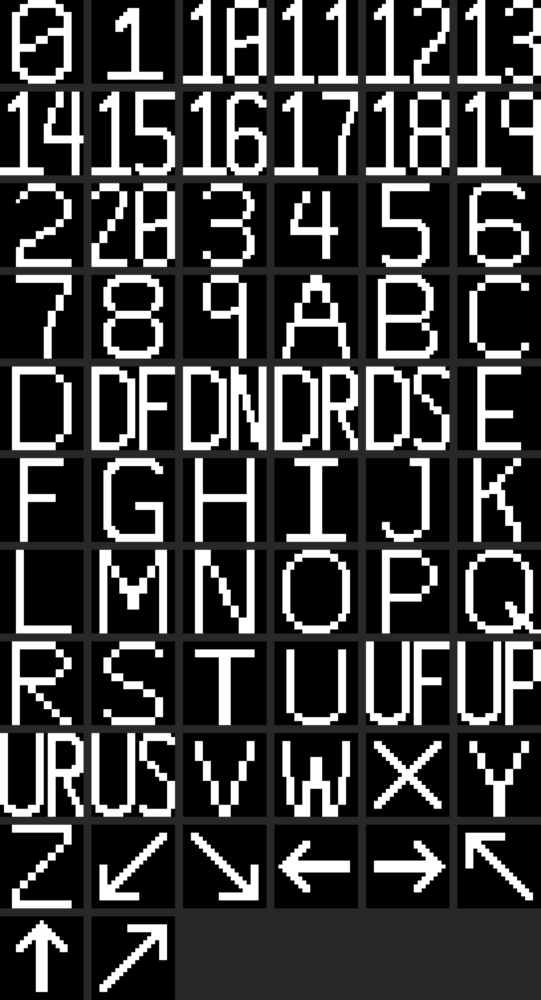
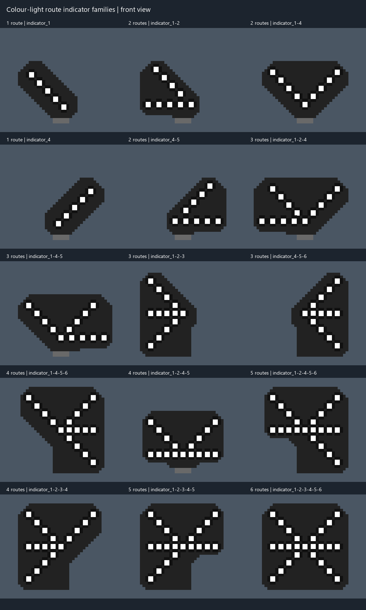
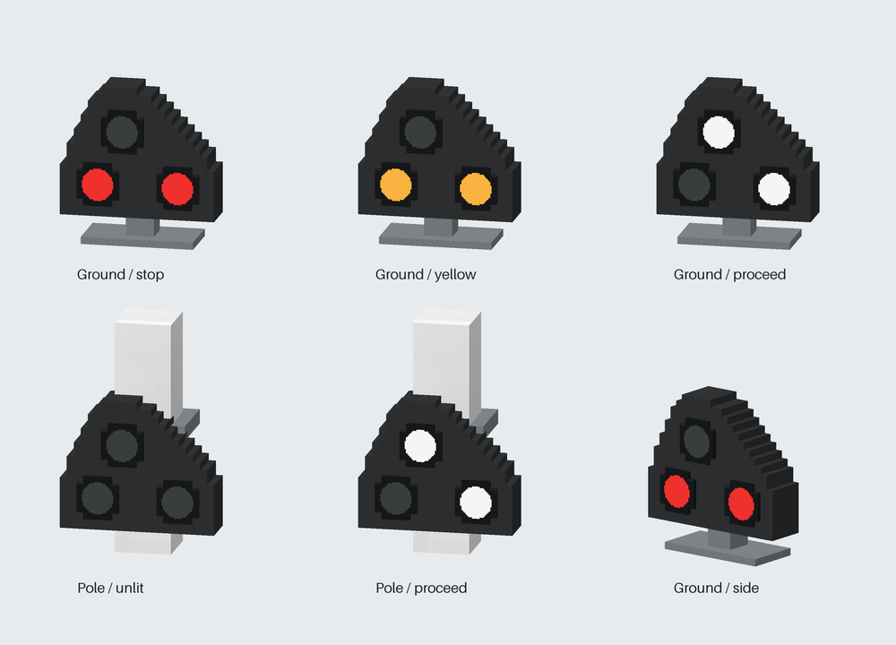
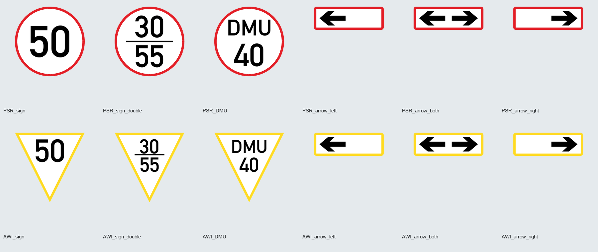

# MTR BR Signal Addon

   

**Build a railway that feels signalled, not merely decorated.**

MTR BR Signal Addon gives MTR a working signalling layer: trains occupy real sections, request real routes, receive a server-authoritative movement limit, and show that state through British-style signals. The same system powers an in-game dispatcher, a private web view, LED route indicators, repeaters, position-light shunts, and decorative speed signs.

**让铁路真正“按信号运行”，而不只是摆上信号装饰。**

本模组为 MTR 加入可运行的信号层：列车占用真实区间、申请真实进路，服务端计算可行驶边界，再由英式信号显示状态。同一套系统还提供游戏内调度台、私有 Web 界面、LED 进路指示器、复示信号机、调车信号和装饰性限速牌。

## What it adds / 模组内容

| English | 中文 |
|---|---|
| **Fixed-block protection** — physical sections, occupancy, reservations, locks, junction resources and safe release. | **固定闭塞防护**——物理区间、占用、预留、锁闭、道岔资源和安全释放。 |
| **Route authority** — bind signals to MTR nodes and authorize only the safe prefix of a requested path. | **进路授权**——将信号绑定到 MTR 节点，只授权申请路径中安全的部分。 |
| **British displays** — colour-light signals, LED route indicators, repeaters and current-layout position lights. | **英式显示设备**——色灯信号、LED 进路指示器、复示信号机和 current 布局调车信号。 |
| **Dispatcher tools** — an in-game console, searchable Web UI and private token administration. | **调度工具**——游戏内调度台、可搜索的 Web UI 和私有 token 管理。 |
| **Decorative signs** — PSR/AWI speed signs with editable lettering, smooth artwork and MTR pole materials. | **装饰标牌**——可编辑文字、平滑图案并使用 MTR 杆材质的 PSR/AWI 限速牌。 |

The signalling engine is separated from the display layer through public device, face, authority and display interfaces. This keeps movement authority independent from the shape, lamp arrangement and artwork of a signal.

信号引擎通过公开的设备、信号面、安全授权和显示接口与显示层解耦。列车授权不依赖信号机的外形、灯位排列或贴图表现。

## Install / 安装

需要 Minecraft 1.20.1、Forge 47.4.18 和 MTR Forge 4.0.3。将 `mtr_brsignal_addon-0.1.2.jar` 与 MTR 一起放入客户端或服务器的 `mods/` 文件夹。

Requires Minecraft 1.20.1, Forge 47.4.18 and MTR Forge 4.0.3. Put `mtr_brsignal_addon-0.1.2.jar` in the `mods/` folder alongside MTR.

## First setup / 初次设置

### 中文

1. 放置 MTR 信号机、轨道节点和需要的显示设备。
2. 用信号调试工具右键信号机，绑定它控制的节点。
3. 用进路工具选中信号，再 Shift+右键目标轨道节点。
4. 用 Shift+右键把进路指示器或复示信号机绑定到主信号。
5. 执行 `/mtrbr protection regenerate` 建立当前拓扑的保护快照。

### English

1. Place MTR signals, rail nodes and the display devices you need.
2. Right-click a signal with the debug tool and bind its controlled node.
3. Select a signal with the route tool, then Shift-right-click the destination node.
4. Shift-right-click a route indicator or repeater, then the main signal, to bind it.
5. Run `/mtrbr protection regenerate` after the first topology setup.

## Routes and displays / 进路与显示

`route=1` 至 `route=6` 用于色灯进路指示器，`path=...` 用于 LED 图案，`shunt=name` 用于调车进路。同一节点可用 `||` 组合：

`route=1` through `route=6` drive colour-light indicators, `path=...` selects LED artwork, and `shunt=name` selects a shunt route. Combine them with `||`:

```text
route=2 || path=1 || shunt=yard_1
```

LED 进路指示器可以显示数字、字母、方向和常用短码，让同一套信号基础设施适应不同的站场和线路命名。

LED route indicators show digits, letters, directions and common short codes, so one signalling system can describe different stations and routes.

<p align="center"></p>

<p align="center"></p>

## Shunting / 调车信号

调车信号必须绑定到主信号，并使用匹配的 `shunt=` 进路。调车放行时主信号可以保持红灯，而调车信号显示双白。列车通过调车入口后即可申请下一段；连续调车逐节点推进，直到遇到普通主信号控制的节点。已有有效授权时，可以不停车通过已开放的调车入口。

<p align="center"></p>

A position-light shunt must be bound to a main signal and a matching `shunt=` route. When cleared, the main signal may remain red while the shunt shows two white lights. After passing a shunt entry, a train may request the next Block immediately; consecutive shunts advance one node at a time until ordinary authority resumes.

信号每 10 tick 重新计算一次，变化立即同步，并以 20 tick 周期作兜底同步。拆除最后一个调车信号后，残留的 `shunt=` 文本不会单独触发调车模式。

Signals recalculate every 10 ticks, synchronize changes immediately, and perform a 20-tick fallback sync. Removing the last position-light device disables shunt mode.

## Speed signs / 限速牌

PSR 是红色圆牌，AWI 是黄色三角牌；两者都有单行、双行和左/双向/右箭头版本。牌面文字可编辑，支持置中、触底、触顶安装，箭头支持触底和触顶安装。它们只改变外观，不改变列车速度、寻路或闭塞。

<p align="center"></p>

PSR signs are red circles and AWI signs are yellow triangles. Both have single- and double-line variants plus left, both-way and right arrows. Text is editable, signs support centre/bottom/top mounting, and arrows support bottom/top mounting. They never change speed, routing or block authority.

## Text signs and brackets / 文字标牌与信号机支架

文字标牌为灰色描边、黑色文字的圆牌。使用调试工具编辑 1–3 个字母或数字（小写输入转为大写）；文字自动缩放、整体居中。第一排安装按钮调整牌面触底/置中/触顶，第二排独立调整杆子下挂/贯穿全块/下触。物品图标为无杆、字母 A 的牌面。

Text signs use a gray circular border and black lettering. Edit 1–3 letters or digits with the debug tool; lowercase input is normalized to uppercase, and text scales and centres automatically. Separate controls select the plate position and pole mounting. The item icon shows A without a pole.

支架提供 (1)、(2)、对应双侧版本和 (1) 左/右护板；(1) 及护板支持 16 方位，其余支持四个正方向。

Brackets come in types (1), (2), their double-sided versions and type (1) left/right guards. Type (1) and guards support 16 orientations; the other variants use four cardinal directions.

本次开发版本使用网络协议 `10`，客户端与服务器需同步更新。旧 `signal_bracket` 注册名改为 `signal_bracket_1`，尚无旧存档自动迁移。

This development build uses network protocol `10`; update server and clients together. The old `signal_bracket` registry ID is now `signal_bracket_1`, with no automatic migration for existing worlds.

## Dispatcher and Web UI / 调度台与 Web 界面

右键调度台或使用调度工具打开面板。按钮在窗口缩放时保持居中，搜索支持中文和日文，列表支持状态筛选、排序和悬浮查看完整字段。生成 token 后可自动打开 Web UI；token 列表和销毁操作只向执行者私下回复。

Open the panel with the dispatcher block or tool. Controls remain centred while the window is resized. Search accepts Chinese and Japanese, and the table supports filtering, sorting and full-value tooltips. Token listing and revocation reply privately to the executor.

```text
/mtrbr requests                              # 查看车辆请求 / inspect requests
/mtrbr approve <vehicle_code>                # 批准车辆 / approve a vehicle
/mtrbr revoke_pending <vehicle_code>         # 撤销待处理请求 / revoke pending request
/mtrbr manual_override <vehicle_code> <true|false> # 设置一次人工越行 / one-shot override
/mtrbr priority <vehicle_code> <value>       # 调整优先级 / set priority
/mtrbr audit                                 # 查看审计信息 / inspect audit state
/mtrbr protection regenerate                 # 重建保护拓扑 / regenerate protection
/mtrbr web_token generate                    # 生成 Web token / generate a token
/mtrbr web_token list                        # 查看自己的 token / list your tokens
/mtrbr web_token revocation                  # 打开销毁列表 / open revocation list
/mtrbr web_token revocation <number>          # 销毁指定 token / revoke one token
/mtrbr web_token list_all                    # OP 查看全部有效 token / OP-only token audit
/mtrbr web_token disable <player>             # 禁止生成新 token / disable issuance
/mtrbr web_token enable <player>              # 恢复生成新 token / enable issuance
```

`list_all` 只向执行命令的 OP 展示所有玩家持有的有效 token。`disable/enable` 按 UUID 持久保存，只控制新 token 的生成，不撤销已有 token。

`list_all` shows valid tokens for every player only to the requesting OP. `disable/enable` persist by UUID and control new issuance without revoking existing tokens.

## Build and develop / 构建与开发

源码构建需要 JDK 17 和 Pillow；调车信号预览还需要 NumPy：

Builds require JDK 17 and Pillow; position-light previews also need NumPy:

```powershell
python -m pip install -r tools/requirements.txt
.\gradlew.bat build --no-daemon
```

资源检查不会重写模型或贴图，并验证 21×21 路径贴图、信号模型、限速牌资源和 MTR 材质。预览统一写入 `build/previews/`；需要保留预览时不要使用 `gradlew clean`。

Resource checks do not rewrite authored models or textures. They verify 21×21 path artwork, signal models, speed-sign resources and bundled MTR materials. Previews are written to `build/previews/`; use `gradlew build` without `clean` when keeping them.

```powershell
python tools/preview_indicators.py
python tools/preview_path_textures.py
python -c "import sys; sys.path.insert(0, 'tools'); from check_position_light_signals import preview; preview()"
```

架构、数据模型、资源约定和迁移记录见 [内容说明.md](内容说明.md)；版本变化见 [CHANGELOG.md](CHANGELOG.md)。

See [内容说明.md](内容说明.md) for architecture, data models, resource conventions and migration notes. Version history is in [CHANGELOG.md](CHANGELOG.md).

## Compatibility and licences / 兼容性与许可

本模组不修改 MTR 源码或原始 JAR，而是通过 addon 侧扩展和 Mixin 接入 MTR。网络协议为 `9`；客户端与服务器必须使用同一构建，即使版本号相同也不要混用更早的 JAR。

The addon does not modify MTR source code or its original JAR. It integrates through addon-side extensions and Mixins. Network protocol `9` is used; clients and servers must run the same build.

源代码采用 [MIT License](LICENSE)。Alte DIN 1451 Mittelschrift Regular 和 Terminus Regular 字体采用 SIL OFL 1.1；字体、MTR 信号杆材质及其来源见 [THIRD_PARTY_NOTICES.md](THIRD_PARTY_NOTICES.md)。

Source code is released under the [MIT License](LICENSE). Alte DIN 1451 Mittelschrift Regular and Terminus Regular use SIL OFL 1.1. Font and MTR signal-pole sources are listed in [THIRD_PARTY_NOTICES.md](THIRD_PARTY_NOTICES.md).
