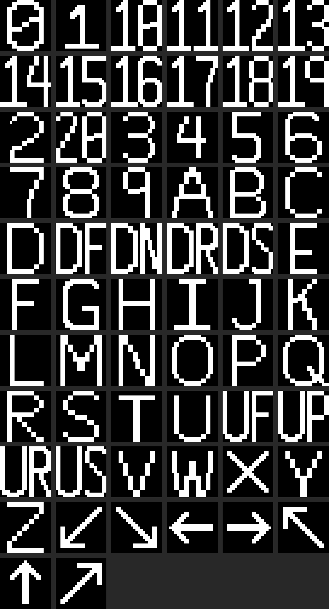
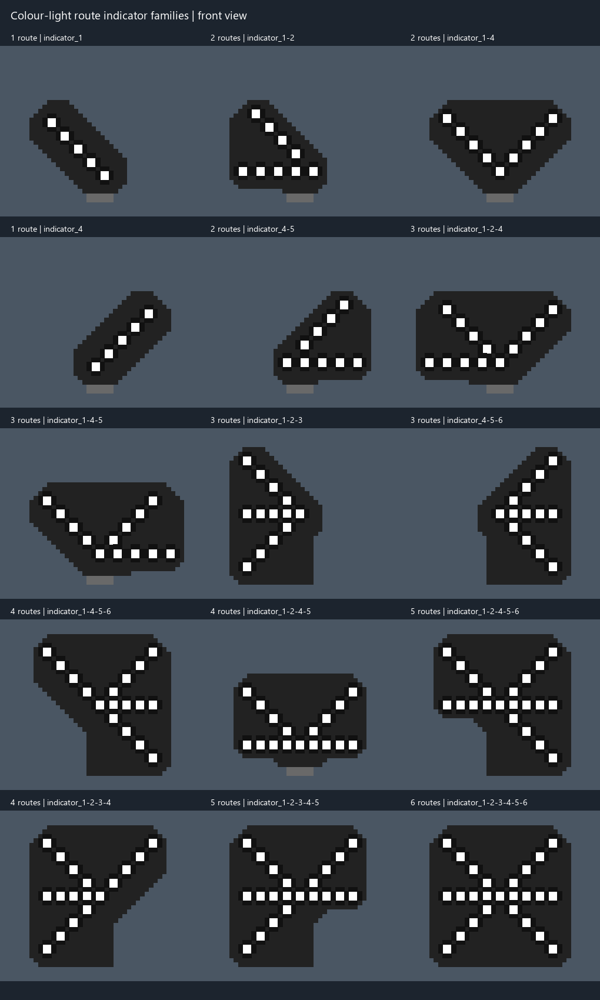
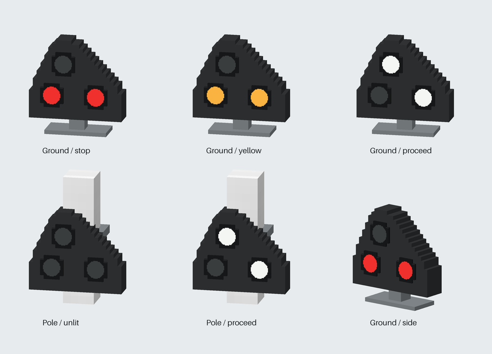
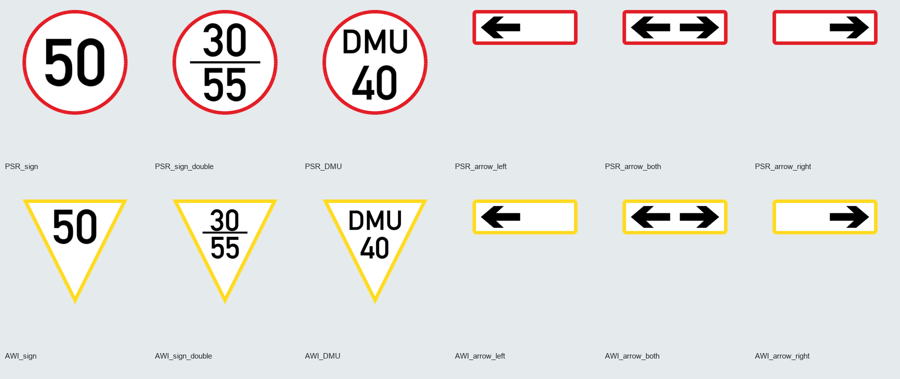

# MTR BR Signal Addon

   

**让你的铁路真正拥有信号系统，而不只是装饰。**

**Build a railway that feels signalled, not merely decorated.**

MTR BR Signal Addon 为 Minecraft Transit Railway 增加服务端权威的英式铁路信号系统：列车占用真实区间、申请完整进路、获得安全行车许可，并通过色灯信号、进路指示器和调车信号显示状态。

MTR BR Signal Addon adds a server-authoritative British-style signalling layer to Minecraft Transit Railway. Trains occupy real sections, request complete routes, receive safe movement authority and display that state through colour-light signals, route indicators and shunting signals.

同时，模组还提供调度台、私有 Web UI、支持进路的红石感应器，以及一套适合完整铁路控制系统的标牌。

It also provides a dispatcher, a private Web UI, BR-aware redstone sensors and polished railway signs for building a complete control system around an MTR network.

## 功能概览 · Features

| 功能 | 说明 |
|---|---|
| **固定闭塞防护** | 跟踪区间占用、预留、锁定、道岔资源和安全释放。 |
| **进路授权** | 只发布申请进路中的安全前缀，并在服务端强制执行。 |
| **英式信号显示** | 提供色灯信号、LED 进路指示器、重复信号和位置灯调车信号。 |
| **调度工具** | 提供游戏内控制台、可搜索 Web UI、审计记录和私有操作员令牌。 |
| **BR 红石感应器** | 根据已授权进路、接近区间和可选目标区间触发红石。 |
| **铁路标牌** | 添加可编辑的 PSR/AWI 限速牌、文字牌和信号机支架。 |

| Feature | What it does |
|---|---|
| **Fixed-block protection** | Tracks occupancy, reservations, locks, junction resources and safe release. |
| **Route authority** | Projects only the safe prefix of a requested route and enforces it server-side. |
| **British signal displays** | Provides colour-light signals, LED route indicators, repeaters and position-light shunts. |
| **Dispatcher tools** | Adds an in-game console, searchable Web UI, audits and private operator tokens. |
| **BR redstone sensors** | Triggers redstone from authorized routes, approach sections and optional target sections. |
| **Railway signs** | Adds editable PSR/AWI speed signs, text signs and signal brackets. |

信号逻辑与显示层通过公开的设备、灯面、授权和显示接口分离，因此行车许可不会依赖信号外形、灯位排列或贴图。

The signalling engine is separated from the display layer through public device, face, authority and display interfaces. Movement authority therefore remains independent from a signal’s shape, lamp arrangement or artwork.

## 安装 · Install

需要 Minecraft 1.20.1、Forge 47.4.18 和 MTR Forge 4.0.3。将 `mtr_brsignal_addon-0.2.0.jar` 放入客户端和服务端的 `mods/` 文件夹。

Requires Minecraft 1.20.1, Forge 47.4.18 and MTR Forge 4.0.3. Put `mtr_brsignal_addon-0.2.0.jar` in the `mods/` folder on both the client and server.

本版本使用网络协议 `11`；客户端和服务端必须使用相同的模组版本。

This build uses network protocol `11`; clients and servers must use the same addon build.

## 初始设置 · First setup

1. 放置 MTR 信号机、轨道节点和需要使用的显示设备。
2. 手持信号机调试工具右键信号机，绑定其控制节点。
3. 使用进路工具选中信号机，再 Shift 右键目标节点。
4. Shift 右键进路指示器或重复信号，再右键主信号机完成绑定。
5. 初次完成线路拓扑后执行 `/mtrbr protection regenerate`。

1. Place MTR signals, rail nodes and any displays you want to use.
2. Right-click a signal with the signal debug tool and bind its controlled node.
3. Select the signal with the route tool, then Shift-right-click the destination node.
4. Shift-right-click a route indicator or repeater, then the main signal, to bind the display.
5. Run `/mtrbr protection regenerate` after the initial topology is ready.

## 进路与显示 · Routes and displays

色灯指示器使用 `route=1` 到 `route=6`。LED 显示器使用 `path=...`，位置灯调车信号使用 `shunt=name`。多个值可以用 `||` 组合：

Colour-light indicators use `route=1` through `route=6`. LED displays use `path=...`, and position-light shunts use `shunt=name`. Values can be combined with `||`:

```text
route=2 || path=1 || shunt=yard_1
```

LED 指示器支持数字、字母、方向和常用缩写，可用同一套信号系统描述车站、车辆段和道岔区域。

LED indicators support numbers, letters, directions and common short codes, allowing one signalling system to describe stations, yards and junctions.

<p align="center"></p>

<p align="center"></p>

## 调车 · Shunting

位置灯调车信号必须绑定主信号机和匹配的 `shunt=` 进路。开放后，主信号机可以保持红灯，而调车信号显示两盏白灯。列车通过调车入口后可以立即申请下一个闭塞；连续调车信号会逐节点推进，直到恢复普通信号授权。

A position-light shunt must be bound to a main signal and a matching `shunt=` route. When cleared, the main signal may remain red while the shunt shows two white lights. After passing a shunt entry, a train may request the next Block immediately; consecutive shunts advance one node at a time until ordinary signal authority resumes.

<p align="center"></p>

信号每 10 tick 重算，变化会立即同步，并每 20 tick 进行一次兜底同步。移除最后一个位置灯设备后，调车模式会关闭。

Signals recalculate every 10 ticks, synchronize changes immediately and perform a 20-tick fallback sync. Removing the last position-light device disables shunt mode.

## 红石列车感应器 · Redstone train sensors

MTR 的 `mtr:train_sensor` 默认仍使用附近列车检测；启用 BR 模式后，才会根据授权进路触发红石。必须手持信号机调试工具右键感应器才能打开设置界面，普通右键不会打开。感应器可以放在任意位置，不必位于轨道下方。

The MTR `mtr:train_sensor` keeps its native nearby-train detection unless BR mode is enabled. To open the addon settings, use the signal debug tool on the sensor; an ordinary right-click does not open this screen. Sensors may be placed anywhere, including away from the track.

BR 模式包含两组独立绑定：**接近区间**决定列车提前多远触发；可选的**目标区间**要求列车当前前方路径经过指定区间，并且每个目标区间必须属于接近区间。

BR mode uses two independent binding groups: **Approach Sections** define how early a train can trigger the sensor, while optional **Targeted Sections** require the train’s forward path to reach one of them. Every target must also be an approach section.

服务端会逐列车检查：列车的有效 BR 授权必须与接近区间重叠；如果配置了目标区间，同一列车当前位置之后的不可变前方路径还必须经过目标区间。因此，只进入接近区间但选择另一条分支的列车不会触发感应器。

The server evaluates each authorized train individually. A trigger requires the train’s active BR authorization to overlap an approach section. When targets are configured, the same train’s immutable forward path must also reach a target after its current position. A train that shares an approach section but takes another branch does not trigger the sensor.

输出模式可以是持续型 `CONTINUOUS`，也可以是脉冲型 `PULSE`。游戏内界面可设置名称、模式、输出类型和脉冲长度；选择 `BIND / WEB` 后，会打开用于地图选点的英文 Web UI。

Output can be `CONTINUOUS`, which stays powered while the condition is true, or `PULSE`, which emits one configurable pulse on each rising condition edge. The in-game screen controls the name, mode, output type and pulse length. Select `BIND / WEB` to open the English Web UI for map-based selection.

Web UI 会列出感应器名称、维度、坐标、加载状态和输出状态，并提供 `BIND`、`CONFIRM`、`CANCEL`、`UNBIND` 与 `CLEAR ALL`。按住 Ctrl 可以多选区间。所有 Web 修改都需要经过认证的操作员令牌和权限等级 2。

The Web UI lists sensor names, dimensions, coordinates, loaded state and output state. Binding supports `BIND`, `CONFIRM`, `CANCEL`, `UNBIND` and `CLEAR ALL`; hold Ctrl to select multiple sections. Web changes require an authenticated operator token and permission level 2.

## 限速牌 · Speed signs

PSR 限速牌为红色圆牌，AWI 限速牌为黄色三角牌。两者都支持单行、双行、可编辑文字，以及左向、双向和右向箭头，并提供居中、底部和顶部安装方式。这些标牌只用于装饰，不会改变列车速度、进路或行车许可。

PSR signs are red circles and AWI signs are yellow triangles. Both support single- and double-line variants, editable lettering and left, both-way or right arrows. Centre, bottom and top mounting options are available. These signs are decorative and do not change train speed, routing or authority.

<p align="center"></p>

## 文字牌与支架 · Text signs and brackets

文字牌使用灰色圆形边框和黑色字样。调试工具可以编辑一到三个字母或数字，文字会自动转为大写、缩放并居中。独立选项可以调整牌面和立柱安装方式。

Text signs use a grey circular border and black lettering. The debug tool edits one to three letters or digits; text is normalized to uppercase, scaled and centred automatically. Separate controls select the plate and pole mounting.

支架提供 type (1)、type (2)、双面版本，以及 type (1) 左右护栏。type (1) 和护栏版本支持 16 个朝向，其余版本使用四个基本方向。

Brackets are available in type (1), type (2), double-sided versions and type (1) left/right guards. Type (1) and guard variants support 16 orientations; the other variants use the four cardinal directions.

## 调度台与 Web UI · Dispatcher and Web UI

可以通过控制台方块或调度工具打开调度台。Web UI 提供实时拓扑地图、区间状态、信号状态、车辆申请、进路编辑和操作员控制；搜索、状态筛选、排序和完整值提示让大型网络更易管理。

Open the dispatcher with the console block or dispatcher tool. The Web UI provides a live topology map, section state, signal state, vehicle requests, route editing and operator controls. Search, status filters, sorting and full-value tooltips keep large networks manageable.

```text
/mtrbr requests
/mtrbr approve <vehicle_code>
/mtrbr revoke_pending <vehicle_code>
/mtrbr manual_override <vehicle_code> <true|false>
/mtrbr priority <vehicle_code> <value>
/mtrbr audit
/mtrbr protection regenerate
/mtrbr web_token generate
/mtrbr web_token list
/mtrbr web_token revocation
```

Web 控制需要经过认证的操作员令牌。令牌为私有、绑定设备，并限制为权限等级 2。专用服务器需要在打开 Web UI 前配置 `web_public_host`。

Web controls require an authenticated operator token. Tokens are private, device-bound and limited to permission level 2. On a dedicated server, configure `web_public_host` before opening the Web UI.

## 构建与开发 · Build and develop

构建需要 JDK 17 和 Pillow；生成位置灯预览还需要 NumPy：

Builds require JDK 17 and Pillow. Position-light previews also require NumPy:

```powershell
python -m pip install -r tools/requirements.txt
.\gradlew.bat build --no-daemon
```

资源检查不会改写已有模型或纹理，只会验证 21×21 进路贴图、信号模型、限速牌资源和内置 MTR 材料。预览文件写入 `build/previews/`；如果要保留预览，请避免执行 `gradlew clean`。

Resource checks do not rewrite authored models or textures. They verify 21×21 path artwork, signal models, speed-sign resources and bundled MTR materials. Previews are written to `build/previews/`; avoid `gradlew clean` when keeping them.

```powershell
python tools/preview_indicators.py
python tools/preview_path_textures.py
python -c "import sys; sys.path.insert(0, 'tools'); from check_position_light_signals import preview; preview()"
```

详细架构说明见 [内容说明.md](内容说明.md)，版本历史见 [CHANGELOG.md](CHANGELOG.md)。

See [内容说明.md](内容说明.md) for the detailed architecture and [CHANGELOG.md](CHANGELOG.md) for release history.

## 兼容性与许可 · Compatibility and licences

本模组不会修改 MTR 源码或原始 JAR，而是通过模组侧扩展和 Mixins 集成。模组版本或网络协议变化时，请同时更新客户端和服务端。

The addon does not modify MTR source code or its original JAR. It integrates through addon-side extensions and Mixins. Update client and server together whenever the addon build or network protocol changes.

源代码使用 [MIT License](LICENSE) 发布。Alte DIN 1451 Mittelschrift Regular 和 Terminus Regular 使用 SIL OFL 1.1。字体、MTR 信号柱及其他第三方来源列于 [THIRD_PARTY_NOTICES.md](THIRD_PARTY_NOTICES.md)。

Source code is released under the [MIT License](LICENSE). Alte DIN 1451 Mittelschrift Regular and Terminus Regular use SIL OFL 1.1. Font, MTR signal-pole and other third-party sources are listed in [THIRD_PARTY_NOTICES.md](THIRD_PARTY_NOTICES.md).
